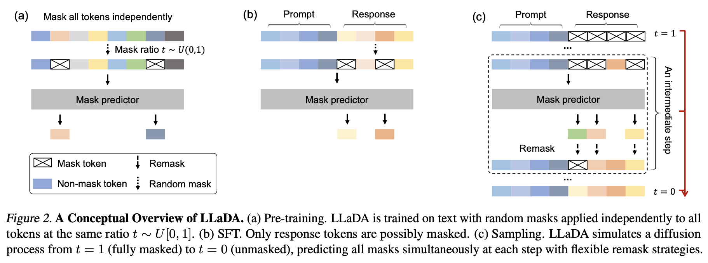
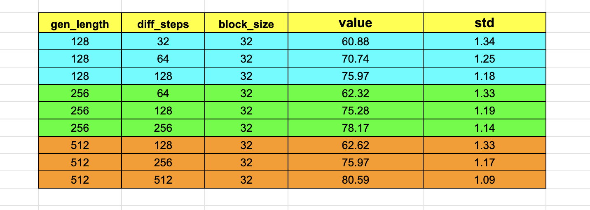
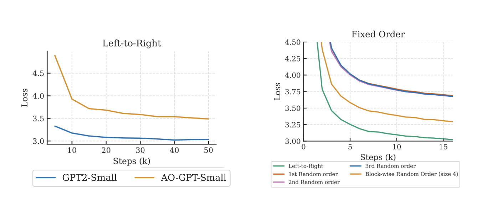
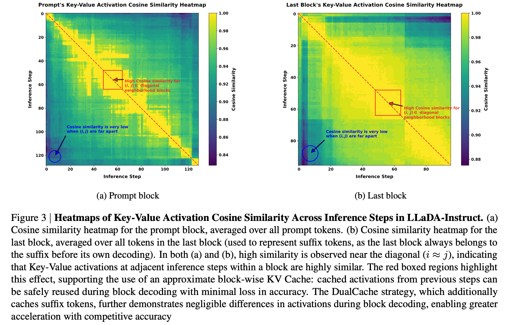
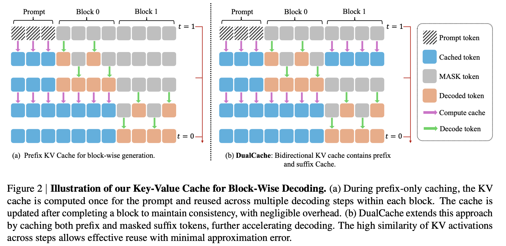
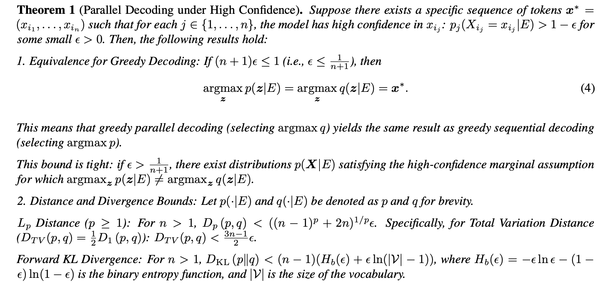
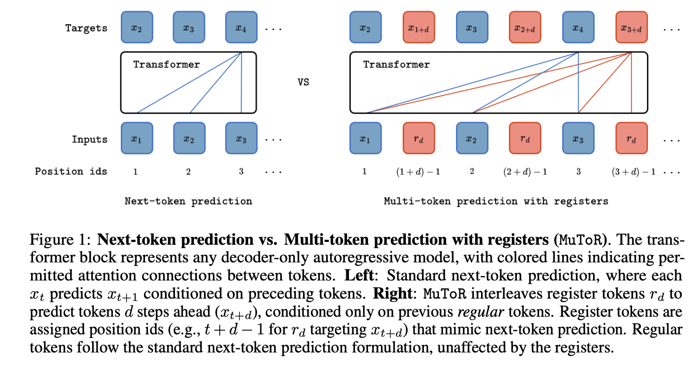

  

> Assessing masked diffusion language models viability for multi‑token prediction, diagnosing their efficiency and learning challenges, and surveying emerging solutions within the broader multi‑token prediction landscape. 

We seek to consolidate our recent reflections on diffusion language models (DLLMs), with particular emphasis on the mainstream semi‑autoregressive, mask‑based variants. Whether DLLMs can ultimately replace autoregressive (AR) models as the default backbone for large language models remains an open question; nevertheless, they offer a promising alternative for multi‑token prediction tasks. Present‑day open-source DLLMs confront two principal challenges. First, the generation efficiency of pure DLLMs is still under debate: their architectures do not naturally accommodate key‑value caching, and overly aggressive reductions in the number of denoising function evaluations (NFEs) can markedly impair generation quality. Second, because a mask‑based DLLM can be regarded as any‑order AR model, it faces a higher learning complexity on textual data than a pure AR counterpart. This note reviews these challenges, surveys current exploratory solutions, and discusses how DLLMs intersect with the broader paradigm of multi‑token prediction.

## 1 Autoregressive Models

In classical autoregressive (AR) language models, training is typically performed with **next-token prediction** under **teacher forcing**. The learning objective is

$$
-\log p_{\boldsymbol{\theta}}(\boldsymbol{x})=-\sum_{i=1}^n \log p_{\boldsymbol{\theta}}\left(\boldsymbol{x}^i \mid \boldsymbol{x}^{<i}\right):=\mathcal{L}_{\mathrm{AR}}
$$

i.e., maximizing the log-likelihood of the next token  $\boldsymbol{x}^{i}$ conditioned on the prefix   $\boldsymbol{x}^{<i}$ . This paradigm has achieved outstanding success across a wide range of natural-language processing tasks.

At inference time, however, an AR model customarily produces **one token per step**. If KV-caching is ignored, the decoding complexity scales as $O(n^{2})$ with sequence length $n$. With KV-caching, the complexity reduces to $O(n)$. Although this is efficient for many short-text scenarios, it remains a bottleneck for long-form generation.

## 2 Diffusion Language Models

**Diffusion Language Models (DLMs)** - in particular, focusing on the prevailing **mask-based/absorbing-state** variants (hereafter collectively referred to as **MDLLM**)

### 2.1 Notations

let $\boldsymbol{x}_t=(x^{1}_t,\dots,x^{n}_t)$ indicate the target textual sequence,

- **upper index $i$**：representing the position of the token within a sequence；
- **lower index  $t\in[0,1]$**：denoting the denoising step
    - $t=0$：original real text $\boldsymbol{x}_{0}$;
    - $t=1$：all masked sequence $\boldsymbol{x}_{1}$;

As a result，$x_{t}^{i}$ is「the *i-th* token of the sequence at the *t-th* denoising step」. We refer to the transformation of a sequence from the fully-masked state $x_1$ to the complete text sequence $x_0$ as **denoising**; the reverse direction is termed **noising**.

---

### 2.2 Training Objective

The negative log-likelihood of an MDLLM can be upper-bounded by

$$
-\log p_{\boldsymbol{\theta}}(\boldsymbol{x}) \leq \int_0^1 \frac{1}{t} \mathbb{E}_{q_{t \mid 0}\left(\boldsymbol{x}_t \mid \boldsymbol{x}_0\right)}\left[\sum_{i: \boldsymbol{x}_0^i=[\mathrm{MASK}]}-\log p_{\boldsymbol{\theta}}\left(\boldsymbol{x}_0^i \mid \boldsymbol{x}_t\right)\right] \mathrm{d} t:=\mathcal{L}_{\mathrm{MDM}}
$$

Tracing the derivation back to **D3PM** [9] and a subsequent line of work [2, 4, 5, 10], including SEDD and RADD, one eventually arrives at this expression. If we momentarily ignore the outer integral over $t$ and the conditional expectation, the remaining term

$$
\sum_{i: \boldsymbol{x}_0^i=[\mathrm{MASK}]}-\log p_{\boldsymbol{\theta}}\left(\boldsymbol{x}_0^i \mid \boldsymbol{x}_t\right)
$$

reduces to reconstructing the masked tokens within the noisy sequence $x_t$ (which contains both clear and masked tokens). This is closely analogous to

**BERT’s masked-language-modeling objective**; indeed, the absorbing-state formulation of D3PM was itself inspired by BERT.

In practice, one typically samples $t\sim\text{Unif}[0,1]$and, for that fixed $t$, generates multiple randomly masked versions of $x_t$. These samples—each sharing the same noise level determined by $t$ — are used to Monte-Carlo estimate the conditional expectation.

### 2.3 Example: The training, finetuning and sampling of LLaDA

Figure below (not shown here) illustrates the three stages of an MDLLM pipeline using **LLaDA** [1] as an example: **(a) pretraining, (b) SFT** and **(c) Sampling.**

|  | Process |
| --- | --- |
| **(a) Pre-training** | Mask every token in a sentence **independently**, with the masking ratio $t\sim\mathrm{U}[0,1]$.  The model receives the noisy sequence $x_{t}$ as input and outputs a reconstruction distribution for every masked position; the objective is the MDLLM loss $\mathcal{L}_{\text{MDM}}$. |
| **(b) Supervised Fine-Tuning (SFT)** | Under a prompt–response setting, mask **only** the tokens in the response, leaving the prompt fully visible so as to strengthen conditional generation.  The loss is evaluated exactly as in pre-training. |
| **(c) Sampling** | Begin from a fully masked state $x_{1}$ and iterate over a discrete schedule $1=t_{0}>t_{1}>\dots>t_{K}=0$:
1. Predict the masked tokens given the current $x_{t_{k}}$.
2. Retain high-confidence predictions while re-masking low-confidence positions (the “remask” strategy) to preserve stochasticity.
3. Proceed to the next time step $t_{k+1}$
After several iterations the process yields the final text $x_0$.  In **LLaDA**, the confidence filter keeps a fixed number of tokens in each denoising step: for a target length $N$ and $T$ denoising steps, exactly $\max\{1,\,N/T\}$tokens are preserved per step. |

### 2.4 Semi-Autoregressive MDLLM

**Semi-AR-MDLLM** integrates conventional autoregressive (AR) decoding with a Mask-Based Diffusion Language Model (MDLLM).  Its logic is deliberately straightforward：

1. **Blocking/Chunking** Partition the target sequence into equal-length segments, denoted *Block 0, Block 1, …, Block n* ;
2. **Inter-block Autoregression** Generate the blocks left-to-right—first *Block 0*, then *Block 1*, and so on—thereby preserving causality across blocks；
3. **Intra-block Diffusion** Within each block, tokens are denoised through MDLLM’s unmasking mechanism ;

This design yields a trade-off between pure AR and full MDLLM decoding:

- **Block length $= 1$ $\rightarrow$  pure AR decoding**；
- **Block length $=$ sequence length** $\rightarrow$ **single-shot MDLLM**；

The figure blow schematically illustrates the semi-autoregressive sampling schedule.  At the initial step ($t=1$) all tokens except the prompt are masked.  The model then successively reconstructs *Block 0 -> Block 1 -> Block 2 -> ⋯*, reaching a fully realized sequence at  $t=0$.

- It’s worth noting that In LLada’s implementation, even under semi-AR generation the entire sequence is fed to the model at **every** forward pass.  When generating *Block 0*, for example, the input is *Prompt + Block 0 + Block 1 + Block 2 + ⋯*, rather than *Prompt + Block 0* alone.  We conjecture that this choice ensures consistency with the supervised fine-tuning (SFT) regime, which conditions on the full sequence.

- If the training phase employed *Prompt + Block 0 + … + Block i* for predicting tokens of the *Block i + 1*, then inference could naturally exploit **KV-caching / semi KV caching**, as only the past blocks would need to be re-introduced.  In the latter Section, we will introduce BD3LM which utilized this training paradigm.

### 2.5 Any-Order Autoregressive (**AO-AR)**

In **RADD** [4], the authors give a formal proof that the optimization objective of a **Mask-Based Diffusion Language Model** (MDLLM) is equivalent to that of an **arbitrary-order autoregressive** (AO-AR) model—exemplified by **$\sigma$-GPT** [14]. Readers interested in the full derivation are referred to the original paper [4]. Specifically, the AO-AR loss can be expressed as

$$
-\log p_{\theta}(\boldsymbol{x}) = -\log \mathbb{E}_{\sigma \sim \mathcal{U}(S_n)} p_{\theta}(\boldsymbol{x} \mid \boldsymbol{\sigma}) \le \mathbb{E}_{\sigma \sim \mathcal{U}(S_n)} \left[ - \sum_{i=1}^{n} \log p_{\theta}(\boldsymbol{x}_{\sigma_i} \mid \boldsymbol{x}_{\sigma_{<i}}) \right] := \mathcal{L}_{\text{AOAR}}
$$

### Intuitively

- **MDLLM** decodes by iteratively unmasking randomly chosen positions, so the order of its outputs is inherently unordered ;
- An **AO-AR** model (e.g., $\sigma$-GPT) first applies an explicit **random permutation** to the input sequence and then predicts tokens in that permuted order.
- Both mechanisms break the sequence’s original causal order, making their theoretical equivalence unsurprising.

## 3 Some problems

- **The sampling is inefficient**
    1. **KV caching**
        
        For a pure autoregressive (AR) model, the implementation of the KV-caching mechanism is quite natural due to the causal nature of its attention mask (here, the "attention mask" refers specifically to the one used within the attention layer, which should be distinguished from the mask tokens added to the input sequence in MDLLM). As illustrated below, at each step, the model attends only to the current token and its preceding tokens. This design allows the previously computed key and value (K and V) representations to be cached and reused when predicting the next token, thus avoiding redundant computation.
        
        In contrast, MDLLM adopts a full attention mask, meaning that whenever a [MASK] token in the input sequence is unmasked, all K and V representations throughout the network must be recomputed. As a result, the architecture is inherently incompatible with KV-caching. This presents a key limitation: although MDLLM is capable of generating multiple tokens in a single forward pass during inference, the lack of KV-caching prevents it from achieving high generation efficiency. Each diffusion step still requires a full forward pass over all tokens in the sequence. In comparison, an AR model equipped with KV-caching only needs to process the current token at each generation step, resulting in significantly faster inference.
        
        
        
    2. **Parallel Decoding**
        
        The issue under consideration concerns MDLLM when more than one token is unmasked during each denoising step. Our experiments show that setting the number of unmasked tokens to one per step generally produces the best results—although inference is then the slowest. When the number of tokens unmasked per step is increased, evaluation performance degrades accordingly.
        
        The figure below reports our results for LLaDA-Instruct [1] on GSM8K with 5-shot prompting. The number of tokens unmasked at each step is given by $\text{gen\_length} / \text{diff\_steps}$, where “**gen_length”** is the maximum generation length and “**diff_steps”** is the total number of denoising steps. It is evident that accuracy drops substantially as the number of tokens unmasked at each step increases.
        
        
        
- ***Relative to a standard autoregressive (AR) model, training an MDLLM model appears to be appreciably more complex***
    
    Because we have not yet had the opportunity to conduct large-scale training ourselves, we draw on the most recent findings of an arxiv paper[3], whose experiments are built on equivalent objectives between **AO-AR** models and **MDLLM** [4]. A direct head-to-head comparison between AR and MDLLM would confound architectural effects: AR models are almost always implemented in a decoder-only form, whereas MDLLM is encoder-only. The authors therefore begin by contrasting an **AO-AR** model with a conventional **AR** model, since both can share the same decoder-only architecture and the AO-AR training objective is equivalent to that of MDLLM [4]. By simply juxtaposing the training losses of, for example, AO-AR and a baseline AR model, one can gauge the relative ease or difficulty of training MDLLM versus AR models.
    
    1. **Left panel**
        
        GPT-2-small represents the AR baseline, and AO-GPT-small the AO-AR counterpart. Both models decode left-to-right, but at input time the AR baseline receives the sequence in its original causal order, whereas the AO-AR model is fed a randomly permuted version. Under identical numbers of training steps, the AR model attains a lower loss, indicating that learning from text is easier for the AR model than for the AO-AR (and hence MDLLM). This result is intuitive: most random permutations partially destroy the information carried by the original word order, and textual data possess an intrinsic causal structure that an AR model can exploit naturally.
        
    2. **Right panel**
        
        The figure probes how different fixed permutations affect learning difficulty for the AO-AR model (contrast this with the AO-GPT curve of left panel, where a fresh random permutation is applied to every input on-the-fly). The study evaluates
        
        - **identity** (the original left-to-right order),
        - **random** permutations (three independent instances), and
        - **block-wise random** permutations—random order inside each block but causal between blocks (e.g., 1-3-2-4-6-5-8-7 for two blocks of length four).
        
        Across all settings, the identity (left-to-right) order persistently yields the lowest loss, confirming that preserving the natural causal structure of language markedly eases training.
        
        
        
    
    Moreover, the paper directly contrasts the AO-AR model with the original MDLLM—treating both as variants of MDLLM that differ only in architecture (AO-AR is **decoder-only**, whereas the original MDLLM is **encoder-only**). The authors find that the decoder-only AO-AR model lags behind the encoder-only MDLLM in performance; however, this deficit can be mitigated by ensembling predictions obtained from multiple input permutations during inference.
    

## 4 How to solve?

### 4.1 KV Caching

1. **Fast-DLLM [6]：approximated KV-Caching**
    1. Empirical results in [6] show that, although a masked diffusion language model (MDLLM) theoretically requires every token to attend to the keys and values of all positions in the input sequence—forcing a complete refresh of **K** and **V** at each forward pass—the cosine similarity between the **K** and **V** vectors at the same position across consecutive denoising steps is nevertheless quite high (the authors verified this on two models, **LLaDA** [1] and **Dream** [13]).
    2. Leveraging this observation, one can implement a localized approximate KV-caching mechanism within a short temporal window (e.g., successive denoising steps inside the same block). Even though a strict KV-cache is formally incompatible with MDLLM, this high inter-step similarity can still be exploited to reduce redundant computation.
        
        
        
    3. Because Fast-DLLM is based on **LLaDA[1]** and **Dream[13]**, consistency between training and inference requires that each forward pass still feed the prompt **and every block** into the model. This constraint led the authors to introduce **dual caching**. Standard KV-caching can be regarded as prefix caching, since it stores only the keys and values for positions preceding the current block. Dual caching, by contrast, also caches the tensors for the blocks following the current one—reflecting the fact that Fast-DLLM must repeatedly process the prompt together with the full set of blocks at every step.
        
        
        
2. **BD3LM [8]：more consistent KV-Cache**
    1. **Training‐time semi-causal masking.**
        Introducing a **semi-causal mask** during training allows an MDLLM to support **semi-KV caching** natively, though it also nudges the model’s behavior toward the autoregressive (AR) regime.
    2. **Comparison with Fast-DLLM**
        
        i. For **BD3LM**, sampling **with** KV-caching produces exactly the same outputs as sampling **without** KV-caching; the mechanism is therefore exact rather than approximate.
        
        ii. At inference, only the current block and its preceding blocks need to be processed.  The model no longer receives the full input sequence, yielding lower computational cost.
        
        iii. The main drawback is that an existing MDLLM must be **re-trained** or at least **fine-tuned**, whereas Fast-DLLM can be applied directly to a fully-trained model with no additional adjustment.
        
        iv. Their **Vectorized Training** strategy is also noteworthy: by concatenating $x_{0}$ and $x_{t}$ and employing a specially designed attention mask, they achieve highly efficient vectorized optimization.  This constitutes an effective fusion of teacher forcing and diffusion-style training.  Detailed mechanics are given in the paper—see especially Appendix B.6 on the Specialized Attention Mask—and are not expanded upon here.
        

### 4.2 Parallel Decoding

- **Fast-DLLM [6] provides a very useful theorem**
    - Before delving into the theorem, let us define some notations first:
        - let $p_{\theta}(\,\cdot \mid E)$ be probability mass function under the condition $E$, where $E$ includes the prompt $p_{0}$ as well as some unmasked tokens that has been generated.
        - Assuming the model need to generate $n$ new tokens at positions  $i_{1},\dots,i_{n}$  (pls note that here we do not require the causality between the tokens’ positions).
        - Assuming $X \;=\; (X_{i_{1}},\dots,X_{i_{n}})$ .
        - **joint distribution：**$p(X\mid E)
        \;\equiv\;
        p_{\theta}\!\bigl(X_{i_{1}},\dots,X_{i_{n}}\mid E\bigr)$, describing the joint distribution of $X$ given the prefilled content $E$.
        - **marginal distribution：**$p_{j}(X_{i_{j}}\mid E)
        \;\equiv\;
        p_{\theta}\!\bigl(X_{i_{j}}\mid E\bigr)$, which give the marginal conditional at the position  $i_{j}$ .
        - Parallel Decoding utilize these marginal conditionals to generate the whole context, that is, $q(X\mid E)
        \;=\;
        \prod_{j=1}^{n}
        p_{j}(X_{i_{j}}\mid E)$.
    - Then we have：
        
        
        
    - **This theorem indicates that greedy parallel decoding, which, given the current prefix, selects several future tokens independently by greedily sampling from the marginal distributions 
    $p_{j}(X_{i_{j}}\mid E)$,** is identical to **greedy sequential decoding** from the full joint distribution $p(X\mid E)
    \;=\;
    p_{\theta}\!\bigl(X_{i_{1}},\dots,X_{i_{n}}\mid E\bigr)$, provided that every marginal probability satisfies $p_{j}(X_{i_{j}}=x_{i_{j}}\mid E) > \frac{n}{n+1}$.
- **Practical implementation strategy**
    - **Fixed-threshold control.**
        
        In practice, **Fast-DLLM** does not enforce the theorem’s exact condition.  Instead, it regulates the degree of parallel decoding in each denoising step with a fixed probability threshold.
        
    - **Concrete procedure (threshold = 0.9).**
        - If a masked position attains a predicted probability **> 0.9**, its token is accepted immediately—regardless of how many unmasked tokens have already been accepted in the current step.
        - Otherwise, the algorithm checks whether **any** masked position exceeds the 0.9 threshold. If none does, it accepts **the token with the highest predicted probability**, thereby guaranteeing that at least one token is produced in every step.
    - **Empirical performance.**
        
        This heuristic substantially reduces computational overhead and performs well in practice.  Although it deviates from the theorem’s strictly greedy criterion, system-level experiments indicate that the approach is effective.
        
- **Strict implementation under the theorem.**
    - We reproduced the theorem’s exact procedure in code and carried out a small-scale test; in practice it **does work.**
    - Concrete algorithmic steps:
        - **Collect greedy-unmasking probabilities.**
            
            For every masked region (block), perform one round of greedy unmasking at all masked positions and record the probability assigned to the selected token at each position. Example. For the sequence “今天吃 [mask1][mask2]”, suppose the model’s distribution for **[mask1]** is {“什”: 0.7, “鱼”: 0.2, “其他”: 0.1}.  Greedy unmasking chooses the token “什” with probability 0.7.
            
        - **Sort in descending order.**
            
            Gather the selected tokens across all masked positions and sort them by their probabilities. 
            
            Let $a = [0.90,\,0.85,\,0.81,\,0.70,\,0.40,\,0.10,\,0.05,\,0.01]$, index $=[2, 3, 0, 1, 4, 6, 7, 5]$
            
        - **Construct a threshold sequence and filter.**
            
            By Theorem 1, define 
            
            $$
            b = \Bigl[0,\,\tfrac23,\,\tfrac34,\,\tfrac45,\,\tfrac56,\,\tfrac67,\,\tfrac78,\,\tfrac89\Bigr]
            $$
            
            (The first entry is set to 0 because each denoising step must accept at least one prediction, so the highest-probability token is always retained.)
            
            Identify the largest index $k$ such that $a_k>b_k$.  In this example $k=2$.
            
        - **Retain high-confidence tokens.**
            
            Keep only the tokens whose probabilities are 0.90,  0.85,  0.81 (indices 2, 3, 0).  All other tokens produced by unmasking are **remasked.**
            

## 5 Multi-Token Prediction

The central idea of **Multi-Token Prediction** is to emit several future tokens per decoding step while incurring negligible additional compute.  Current implementations (the list is not exhaustive) fall into two broad categories:

1. **Multi-head parallel prediction** [11].
    
    Additional prediction heads ($head_1 … head_k$) simultaneously generate $x^{t+1},\dots,x^{t+k}$.  A high-confidence teacher model then verifies and filters the candidates token by token — i.e., speculative decoding.  A representative example is **Medusa** [12].
    
2. **Register-token schemes**.

    Register tokens are periodically inserted into the input; their hidden states are used to predict several subsequent regular tokens.  A recent instance is **MuToR** [7].  (MuToR is aimed not at higher throughput but at **improved performance**; recent work [11] suggests that MTP training, by injecting forecasts of future tokens, provides stronger planning signals.  These issues, however, lie outside the focus of the present note.)
    

For today’s mainstream **Semi-AR MDLLM** variants, their behavior is in many ways reminiscent of **register-token** MTP schemes:

- The right-hand panel (excerpted from MuToR) can be read as predicting, at each step, **one regular token and one register token**.  Both tokens attend only to themselves and the preceding regular tokens.  The register token forecasts a future token that is offset by a pre-defined shift $d$.
- Suppose we ignore Fast-DLLM’s threshold-driven parallel decoding and adopt the simplest policy—generating a fixed $C$ tokens per denoising step—and likewise set the block size to $C$.  When processing block $k$, we can treat every **[MASK]** position as a register token and assign to each a distinct random shift $d\in[1,C]$.  Under this construction, Semi-AR decoding reduces exactly to the second type of MTP outlined above.
- In a conventional AR model, position $i$ predicts token $x^{i+1}$; in an MDLLM, position $i$ typically predicts $x^i$.  This is not a hard rule, however: for example, in [13] the authors align MDLLM positions to match AR decoding.

## Contributions

- [Yezhen Wang](https://scholar.google.com/citations?user=g-VEnLEAAAAJ&hl=zh-CN)
- [Bo Li](https://brianboli.com/)

## Reference

<small>
[1] Large Language Diffusion Models

[2] Discrete Diffusion Modeling by Estimating the Ratios of the Data Distribution

[3] Any-Order GPT as Masked Diffusion Model: Decoupling Formulation and Architecture

[4] Your Absorbing Discrete Diffusion Secretly Models the Conditional Distributions of Clean Data

[5] Score-Based Continuous-Time Discrete Diffusion Models

[6] Fast-dLLM: Training-free Acceleration of Diffusion LLM by Enabling KV Cache and Parallel Decoding

[7] Multi-Token Prediction Needs Registers

[8] Block Diffusion: Interpolating Between Autoregressive and Diffusion Language Models

[9] Structured Denoising Diffusion Models in Discrete State-Spaces

[10] Simple and Effective Masked Diffusion Language Models

[11] Better & Faster Large Language Models via Multi-token Prediction

[12] Medusa: Simple llm inference acceleration framework with multiple decoding heads

[13] Scaling Diffusion Language Models via Adaptation from Autoregressive Models

[14] $\sigma$-GPTs: A New Approach to Autoregressive Models
</small>