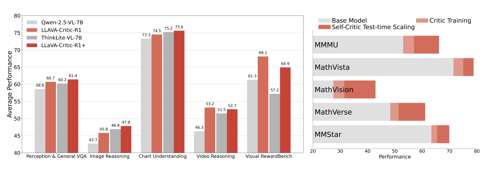

_Figure 1: LLaVA-Critic-R1 is trained on top of the base model Qwen-2.5-VL-7B. Building upon a stronger reasoning VLM, ThinkLite-VL-7B, we further develop LLaVA-Critic-R1+ by applying the same RL critic training procedure. **Left**: Performance comparison of LLaVA-Critic-R1 with other base and reasoning VLMs on multiple visual reasoning, visual understanding, and visual reward benchmarks. LLaVA-Critic-R1 not only significantly outperforms other models in critic performance, but also demonstrates stronger policy capabilities. **Right**: Performance improvement of critic training and test-time self-critic scaling on five common visual reasoning and visual understanding benchmarks. Critic training alone significantly improves the base model's performance. Building upon this, leveraging the dual policy and critic capabilities of LLaVA-Critic-R1 for a "Best-of-128" self-critic scaling procedure at test time leads to a further substantial boost in performance._

## Breaking the Critic-Policy Divide

In vision-language modeling, critic models are typically trained to evaluate outputs—assigning scalar scores or pairwise preferences—rather than to generate responses. This separation from policy models, which produce the responses, is so entrenched that critics are rarely considered for direct policy use.

**LLaVA-Critic-R1** challenges this convention. We propose to reorganize preference-labeled critic datasets into verifiable training signals and perform reinforcement learning directly on a base generative model, producing a multimodal critic trained to optimize preference judgments while retaining full generation ability.

## Surprising Dual Excellence

LLaVA-Critic-R1 emerges not only as a top-performing critic but also as a competitive policy model—matching or surpassing specialized reasoning VLMs trained with in-domain data across 26 visual reasoning and understanding benchmarks, with an average gain of **+5.7%** over its base model (Qwen-2.5-VL-7B).

Extending this approach to existing strong reasoning VLMs yields **LLaVA-Critic-R1+**, which further advances policy performance without sacrificing critic quality, achieving a state-of-the-art **71.9 on MMMU** at the 7B scale.

## Self-Critique at Test Time

The enhanced critic ability benefits inference significantly. Applying self-critique at test time yields an average **+13.8% improvement** on five representative reasoning tasks without additional training. This demonstrates the power of unified critic-policy models for creating self-improving systems.

## Technical Innovation

Our approach centers on three key innovations:

**Data Reorganization**: We transform preference-labeled critic datasets into verifiable training signals suitable for reinforcement learning.

**GRPO Training**: We apply Group Relative Policy Optimization directly on generative models, enabling them to learn from critic data while maintaining generation capabilities.

**Unified Architecture**: We maintain a single model for both critic and policy functions, eliminating the traditional separation between evaluation and generation.

## Model Performance

LLaVA-Critic-R1 demonstrates strong performance across diverse benchmarks:

- **Visual Reasoning**: Competitive performance with specialized models on complex reasoning tasks
- **Critic Evaluation**: Top-tier preference judgment and scalar scoring capabilities
- **Generation Quality**: Maintained fluency and coherence with strong instruction following

The model comes in two variants:

- **LLaVA-Critic-R1**: Base model trained from Qwen-2.5-VL-7B
- **LLaVA-Critic-R1+**: Extended approach applied to strong reasoning VLMs

## Implications for the Field

Our results reveal that RL training on critic data can produce a unified model excelling at both evaluation and generation, offering a simple path toward scalable, self-improving multimodal systems. This work demonstrates that the traditional separation between critics and policies is not necessary—a single model can excel at both tasks simultaneously.

## Resources

### 🚀 [Code Repository](https://github.com/LLaVA-VL/LLaVA-NeXT/tree/main/LLaVA-Critic-R1)

Access training code and implementation details

### 🤗 [Model Collection](https://huggingface.co/collections/lmms-lab/llava-critic-r1-68922484e5822b89fab4aca1)

Download pre-trained model checkpoints

### 📝 [Paper](https://arxiv.org/abs/2509.00676)

Read the full technical paper on arXiv

## Citation

```bibtex
@article{llava-critic-r1-2025,
  title={LLaVA-Critic-R1: Unified Critic and Policy Model Through Reinforcement Learning},
  author={Wang, Xiyao and Li, Chunyuan and Yang, Jianwei and Zhang, Kai and Liu, Bo and Xiong, Tianyi and Huang, Furong},
  journal={arXiv preprint arXiv:2509.00676},
  year={2025}
}
```

## Acknowledgments

This work represents a collaborative effort in advancing the capabilities of multimodal models through innovative training approaches, building upon the strong foundation of the LLaVA project series.
