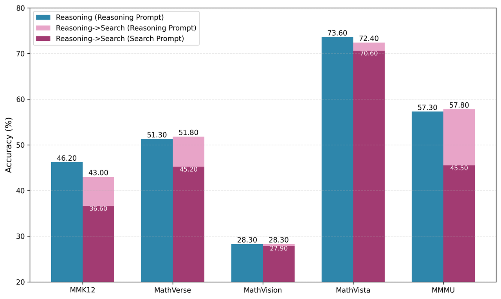
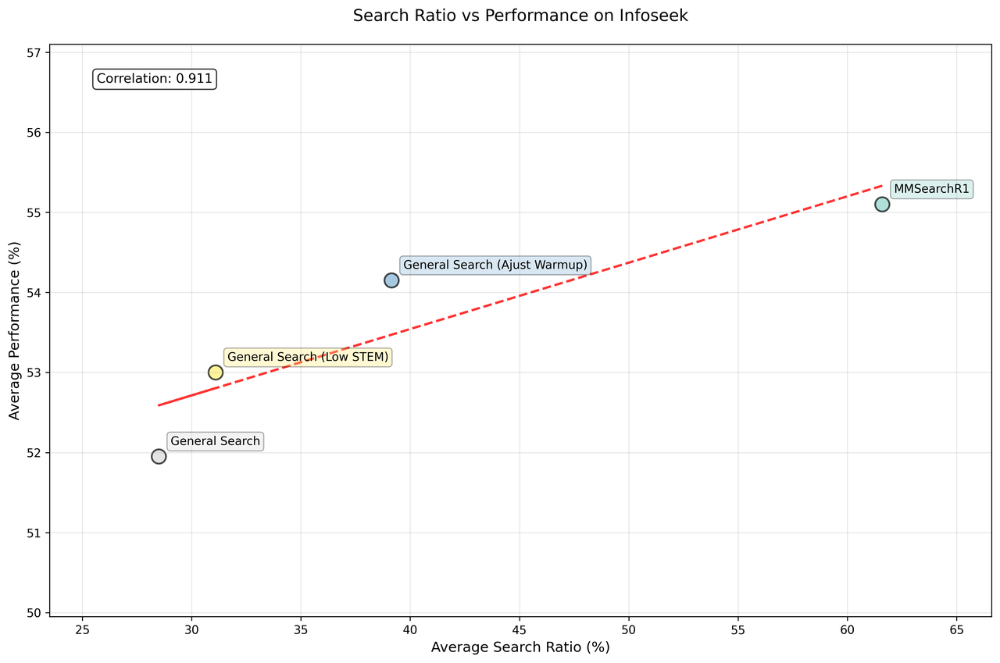
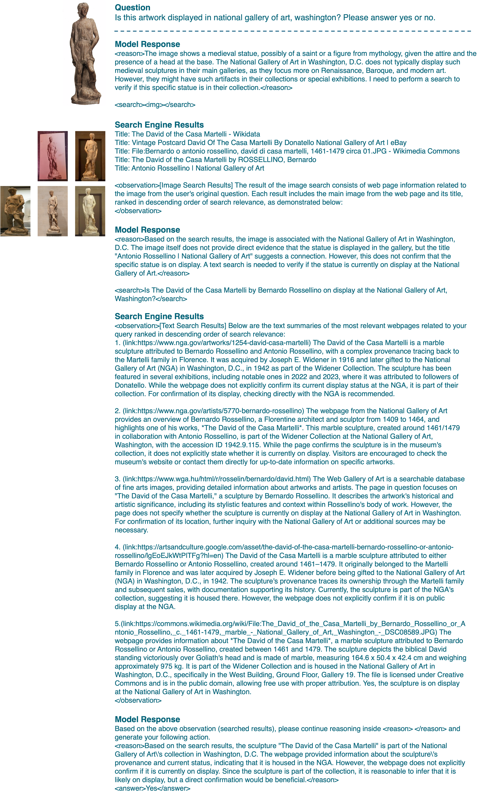
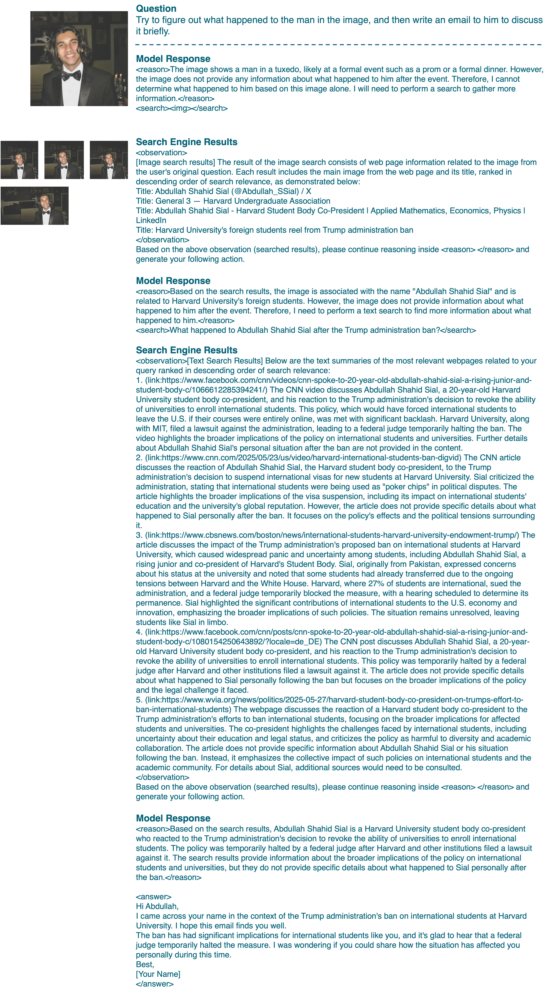

Our previous work, MMSearch-R1, represents a paradigm shift in multimodal AI as the first framework to employ end-to-end reinforcement learning for autonomous tool invocation in large multimodal models (LMMs). By enabling models to independently determine when and how to leverage external search tools, MMSearch-R1 achieves both high efficiency and state-of-the-art performance on open-world tasks, marking a significant advance in practical AI deployment.

What began as a specialized tool-calling model has since evolved into a general-purpose reasoning engine that seamlessly integrates knowledge retrieval with cognitive processing. This evolution offers critical insights into the future of autonomous AI systems: the most capable agents will not only be able to think deeply, but also actively seek and utilize relevant information as needed.

# Reasoning-improved Search
Despite MMSearch-R1's strong performance, we observed limitations in its ability to adapt to complex, dynamic information needs. To address these constraints, we propose a reasoning-first agent paradigm that emphasizes the following core capabilities:

1. Intelligent search: The model reasons about its knowledge gaps to make decisions about when and how to invoke search tools
2. Query generation: Deep task understanding enables context-aware query formulation that evolves with the problem
3. Knowledge integration: External information is systematically incorporated through reasoning processes, not merely retrieved and appended
4. Performance: The approach delivers fundamental advances in multimodal reasoning, not just incremental improvements

## Training Recipe
Prior work in multimodal reasoning has demonstrated that training with verifiable rewards can significantly enhance a model's capabilities in understanding and solving complex STEM problems.
In our initial experiments, we evaluated numerous multimodal STEM datasets. We discovered that many existing datasets suffer from various limitations: some lack sufficient difficulty for advanced models, while others contain noisy annotations, incomplete visual-text alignments, or unverifiable ground truth answers. These issues can produce unreliable reward signals that destabilize reinforcement learning training.
To address these challenges, we curated a comprehensive high-quality training set consisting of: MMPR[1], MMK12[2], MMR1[3], Multi-subject-RLVR[4], ScienceQA.
To ensure data quality for effective multimodal RL training, we implemented a rigorous filtering pipeline:

1. Multimodal Verification: Every problem undergoes automatic verification to ensure visual and textual components are properly aligned and complete. We filter datasets to include only problems where both modalities contribute meaningfully to the solution process.

2. Answer Verifiability: Each problem must have verifiable ground truth answers with clear reasoning paths. For mathematical problems, we verify symbolic and numerical answers; for scientific problems, we ensure explanations align with established principles.

3. Complexity Filtering: Problems must require genuine multimodal reasoning rather than being solvable through text or vision alone. We exclude problems where one modality is merely decorative.

After filtering, we obtained 80K high-quality multimodal STEM problems for RL training.

Our RL training stage follows DAPO[5] with the following modifications:

- No Entropy Loss: We eliminate entropy loss entirely, as its inclusion frequently causes training instability characterized by exponential entropy growth and subsequent collapse.
- No KL Loss: Following DAPO, we remove KL loss to allow the model to diverge from the original SFT policy's trust region. This also eliminates reference policy log probability computation, accelerating training.
- Overlong Filtering: We mask loss for truncated sequences to preserve long-context reasoning capabilities.
- Learning Rate Schedule: We implement a sigmoid-based decay schedule. The sigmoid schedule provides smooth S-shaped transitions that stabilize early training and asymptotically approach target rates without discontinuities. We keeps the base learning rate to $2e-6$ and the warmup steps to 60 steps with sigmoid curve progression. The decay is a sigmoid function reducing to 90% of base rate (final LR $\approx 1.8e-6$).
- Improved Exploration: We set the clip high ratio to 0.3 in the GRPO/PPO surrogate loss to encourage exploration and stabilize entropy dynamics.

Our reward function employs a two-stage hierarchical approach combining mathematical verification with LLM-based evaluation. We first apply a static mathematical verifier to assess answer correctness for questions with deterministic solutions. When the verifier returns zero — indicating either incorrect answers or inability to verify, we employ an LLM-as-judge for secondary assessment to handle questions requiring semantic evaluation or those with multiple valid representations (e.g., "teal blue" vs. "blue"), the LLM would judge based on given images, questions, answers and model predictions. 

This design prioritizes computational verification for efficiency while leveraging LLM evaluation for complex semantic cases.

## Result
Based on this foundation, we can build a very strong STEM-focused reasoning model that surpasses the rest of open models.

| Models | MMK12 | MathVerse (testmini) | MathVision (testmini) | MathVista (testmini) | MMMU (val) |
|--------|-------|----------------------|----------------------|----------------------|-------------------------|
| Qwen2.5-VL-7B | 34.4 | 46.2 | 24.0 | 66.6 | 49.8 |
| OpenVL-Thinker | 31.0 | 45.2 | 24.0 | 70.2 | 52.3 |
| R1-OneVision | 30.6 | 44.1 | 24.0 | 64.1 | 49.2 |
| MM-Eureka-7B | 27.0 | 50.3 | 26.9 | 73.0 | 50.7 |
| General STEM | 46.2 | 51.4 | 28.4 | 73.6 | 57.3 |
| General STEM -> Search (Two Stage) | 43.0 | 51.9 | 28.0 | 72.4 | 57.9 |

With this reasoning foundation, we can go further to improve the model's search abilities. We first implemented a two-stage training process to seamlessly integrate search capabilities. This approach ensures that search becomes a natural extension of the model's reasoning process rather than a separate module. 

From the figure, compared with our original MMSearch baseline, which was built on Qwen-2.5-VL-7B (referred to as Instruct → Search in this context), we can observe that the model achieved good improvements. The reasoning-first approach enabled more intelligent search decisions, better query formulation, and more effective utilization of retrieved information.


> Accuracy across four multimodal benchmarks (Infoseek, MMSearch, FVQA, and SimpleVQA). The Reasoning to Search paradigm consistently outperforms or matches Instruct -> Search, especially on Infoseek and MMSearch, demonstrating the benefit of reasoning-first strategies in complex information retrieval tasks.

One of the most intriguing findings emerged during our evaluation of STEM tasks (e.g., MMMU, MathVision) using Search prompts. We observed a counterintuitive phenomenon: excessive searching actually led to decreased performance. Specifically, models employing Search prompts tended to over-rely on external searches, frequently initiating queries for information that could have been inferred through reasoning or was already available internally.



> Accuracy comparison across five challenging reasoning datasets. Results indicate that while integrating search generally helps, excessive or unguided searching can lower performance. This underscores the need for precise reasoning-guided search prompting to achieve optimal results in complex multimodal reasoning tasks.

These performance drops highlight critical insight: without effective reasoning capabilities to guide their search strategies, models tend to default to inefficient search behaviors. This not only results in unnecessary computational overhead but can also introduce irrelevant information, ultimately degrading the quality of answer generation.

| Search Ratio | MM-K12 | MathVerse (testmini) | MathVision (testmini) | MathVista (testmini) | MMMU (val) |
|--------------------|-------|----------------------|----------------------|----------------------|-------------------------|
| Reason -> Search (Search Prompt) | 16.8 | 22.9 | 9.5 | 12.5 | 24.7 |

# Reason to Act for General Search Model
To achieve a robust balance between reasoning and search performance across general-domain tasks, we choose to integrate the training into one stage for both capabilities. Our goal is to build a model that not only retrieves relevant information efficiently but also demonstrates advanced reasoning over searched information.

## Training Recipe
We unify the training process by adopting a ReACT-style prompt template, inspired by [REACT PAPER], which allows the model to interleave reasoning and action (search) steps within a single trajectory. This template is a slight refinement of the standard Search prompt, and full implementation details are provided in the Appendix. 

The table below summarizes the lineage and training data for each model variant, clarifying the distinctions in model initialization and supervision strategies. For comprehensive information on hyperparameters and training dynamics, please refer to the Appendix.

## Result

We evaluated both our two-stage and unified (one-stage) models across a broad suite of benchmarks and consistently observed performance improvements as model capacity increased.

The General STEM model showed that enhancing reasoning capabilities alone can lead to significant gains. In contrast, the General Search model revealed the multiplicative benefits of integrating reasoning with targeted search strategies. Notably, these improvements were not simply incremental - they represent fundamental advances in how models address complex, multimodal problems.

| Models | MMK12 | MathVerse (testmini) | MathVision (testmini) | MathVista (testmini) | MMMU (val) | AI2D | ChartQA | MME | RealworldQA | OCRBench | DocVQA | MMBench | MMStar | MiaBench |
|--------|-------|----------------------|----------------------|----------------------|------------|------|---------|-----|-------------|----------|--------|---------|--------|----------|
| Qwen2.5-VL-7B | 34.4 | 46.2 | 24.0 | 66.6 | 49.8 | 93.3 | 94.4 | 630.4/1685.2 | 68.5 | 85.2 | 94.6 | 82.9 | 62.6 | 81.7 |
| General STEM | 46.2 | 51.4 | 28.4 | 73.6 | 57.3 | 94.4 | 91.4 | 700.7/1662.1 | 67.5 | 83.7 | 92.1 | 83.8 | 65.5 | 76.0 |
| Reason -> Search | 43.2 | 51.7 | 25.0 | 71.8 | 57.9 | 94.0 | 93.6 | 652.5/1688.3 | 67.5 | 81.7 | 93.5 | 83.2 | 63.1 | 47.6 |
| General Search | 43.6 | 52.0 | 27.3 | 74.7 | 56.1 | 94.6 | 94.0 | 718.9/1775.3 | 65.5 | 77.8 | 89.4 | 84.0 | 60.4 | 44.4 |

---

| Models | Infoseek | MMSearch | FVQA | SimpleVQA |
|--------|----------|----------|------|-----------|
| Qwen2.5-VL-7B | 20.1 | 12.8 | 20.3 | 38.4 |
| MMSearch | 55.1 | 53.8 | 58.4 | 57.4 |
| Reasoning -> Search | 58.5 | 57.1 | 57.9 | 57.7 |
| General Search | 52.0 | 54.9 | 52.8 | 57.0 |

---

Our results reveal that MMSearchR1 achieves the highest accuracy across all benchmarks, significantly outperforming standard General Search configurations. The key differentiator is search utilization: MMSearchR1 demonstrates search ratios up to $61.6\%$ on Infoseek, compared to $28.5\%$ for General Search.



> MMSearchR1 achieves the highest accuracy across all benchmarks, significantly outperforming standard General Search configurations. The key differentiator is search utilization: MMSearchR1 demonstrates search ratios up to $61.6\%$ on Infoseek, compared to $28.5\%$ for General Search.

We found a strong positive correlation (Pearson r = 0.911) between search ratio and model performance, indicating that increased search engagement directly improves accuracy. However, this relationship has limits—excessive or undirected search introduces computational costs and answer noise that can degrade reliability.
Additional experiments with reduced STEM data, increased search data ratios, and shortened warmup periods (60 vs 45 steps) confirmed that better performance requires strategic search integration. Models perform best when search is invoked selectively through explicit reasoning about information needs, balancing enhanced knowledge access against computational efficiency.
These findings demonstrate that the key to multimodal model performance lies not in maximizing search frequency, but in developing sophisticated reasoning mechanisms that determine when external information retrieval adds value to complex query resolution.

# Case Study
We show the following interesting cases to demonstrate versatile abilities of our final model.

## Case: MME

In this example from the MME benchmark, the model is required to answer a question about a statue located in the National Gallery of Art in Washington, D.C. The process begins with the model analyzing the query image to determine what additional information is needed. It then performs searches for visually similar images, systematically evaluates the retrieved results, and conducts follow-up searches from different perspectives to verify its findings. This iterative search-and-reasoning approach allows the model to gather comprehensive evidence before arriving at a well-supported conclusion.



## Case: Writing Email to a Public Figure

In this case, the model is tasked with composing an email to Abdullah Shahid Sial, a public figure. To accomplish this effectively, the model must gather comprehensive information about him through internet searches, including his social media presence (Twitter), official website, professional background, and other publicly available information sources.




# Reference
[1] https://huggingface.co/datasets/OpenGVLab/MMPR-v1.2

[2] https://huggingface.co/datasets/FanqingM/MMK12

[3] https://huggingface.co/datasets/MMR1/MMR1-Math-RL-Data-v0

[4] https://huggingface.co/datasets/virtuoussy/Multi-subject-RLVR

# Appendix

## Reasoning Template

```bash
{question}
Please reason step by step. Output the thinking process within <think> </think> tags and final answer within <answer> </answer> tags.
```

## Search Template

```bash
Answer the user's question based on the provided image. Examine the image carefully and identify any recognizable entities, such as faces, objects, locations, events, logos, or text. Determine whether you have sufficient knowledge to confidently recognize the main visual element and answer the user's question. If so, first explain your reasoning, then provide a clear and direct answer.\nIf you are unable to confidently identify the visual element, stop and invoke the image search tool by appending the string <search></search> at the end of your response. This will trigger a Google Lens search using the original image to retrieve relevant information that can help you confirm the visual content.\nOnce you have sufficient visual understanding, combine it with the user's question and assess whether you can confidently answer. If so, answer the question directly using your own knowledge. If not, invoke the text search tool by generating a concise and specific query, and output it in the format <text_search>your query here</text_search> at the end of your response. Carefully craft your query to accurately retrieve the information needed to help answer the question. The text search tool will then use Google Search to return relevant information based on your query.\nYou must include your reasoning inside <reason>...</reason> before taking any action, whether it is calling the image search tool, generating a text search query, or providing a final answer. The reasoning may involve analysis of the original image and question, interpretation of search results, or logical steps leading to the final answer.\nAll search results will be placed inside <information> and </information> and returned to you. When you are ready to answer the question, wrap your final answer between <answer> and </answer>, without detailed illustrations. For example: <answer>Titanic</answer>.\nHere is the image and the question:\n<image>
{question}
```

## ReACT Template

```bash
# System Message
  You are a helpful assistant. You should strictly follow reason-to-act thinking process to answer user provided question. Namely, you should first analyze the question & observation (e.g., user provided image or search results) and then inform the following action. The thinking process should be within <reason> and </reason> tags. The actions you can choose are:
<answer>xxxxx</answer>:  which returns the answer within <answer> and </answer> tags, and finishes the task.
<search>image</search>: which searches user provided image on Google and returns image-related visual entity/concept/knowledge for further reason-to-act. The search results are placed between <observation> and </observation> tags.
<search>text query</search>:  which generates a text query and sent to Google and returns some snippets containing the answer for further reason-to-act. The search results are placed between <observation> and </observation> tags. Note that sometimes the snippets do not contain the answer, and some alternative search might be needed.

  Your output format should be one of the following three formats:  
  <reason> YOUR THINKING PROCESS </reason> 
  <answer> YOUR ANSWER AFTER GETTING ENOUGH INFORMATION </answer>
   or
  <reason> YOUR THINKING PROCESS </reason>
  <search> IMAGE </search>
  or
  <reason> YOUR THINKING PROCESS </reason>
  <search> YOUR GENERATED TEXT QUERY FOR HELPING YOU FIND INFORMATION ON GOOGLE TO ANSWER USER QUESTION </search>

  Only output the final answer (in words, numbers or phrase) inside the <answer></answer> tags, without any explanations or extra information. If this is a yes-or-no question, you should only answer yes or no.
```