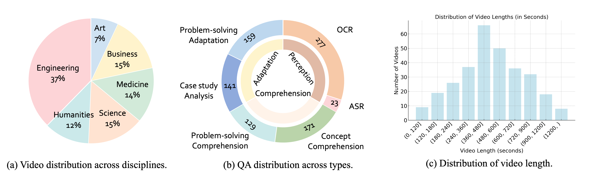

<!--  -->


<p align="center" style="text-align:center;">
  <a href="https://videommmu.github.io/" style="display:inline-block; margin:0 6px;">
    
  </a>
  <a href="https://arxiv.org/abs/2501.13826" style="display:inline-block; margin:0 6px;">
    
  </a>
  <a href="https://huggingface.co/datasets/lmms-lab/VideoMMMU" style="display:inline-block; margin:0 6px;">
    
  </a>
</p>


> **Video-MMMU asks a fundamental question:**
> If a model 'goes to class,' can the model learn from the lecture and apply what it learned to MMMU-style exam problems?


## Motivation

Our original goal was to build a **video reasoning** benchmark, motivated by the observation that the most demanding forms of reasoning arise in **academic settings**—for example, MMMU-style university exam questions.

Online lectures create an ideal environment for evaluating video reasoning. They effectively convey knowledge and naturally test a model’s ability to learn from video. These videos have three key attributes:

1. **High information density** (heavy OCR/ASR signals),
2. **Advanced knowledge requirements** (college-level knowledge),
3. **Temporal structure** (concepts unfolding over time).

These properties make reasoning from lecture video notably harder. This leads to our core question:  
**When a model watches an online lecture, can it learn like a student—understand the content, acquire the knowledge, and then solve related problems?**

Therefore, we introduce **Video-MMMU**, a video reasoning benchmark that evaluates **knowledge acquisition from video**.


---

## 🎓 Video-MMMU Leaderboard

| Model | Overall \| Δknowledge | Perception | Comprehension | Adaptation |
|---|---|---|---|---|
| [GPT-5-thinking](https://openai.com/index/introducing-gpt-5/) | 84.6 \| -- | -- | -- | -- |
| [Gemini-2.5-Pro](https://deepmind.google/models/gemini/pro/) | 83.6 \| -- | -- | -- | -- |
| [OpenAI O3](https://openai.com/index/introducing-o3-and-o4-mini/) | 83.3 \| -- | -- | -- | -- |
| [Claude-3.5-Sonnet](https://www.anthropic.com/news/claude-3-5-sonnet) | 65.78 \| 🟢 +11.4 | 72.00 | 69.67 | 55.67 |
| [Kimi-VL-A3B-Thinking-2506](https://huggingface.co/moonshotai/Kimi-VL-A3B-Thinking-2506) | 65.22 \| 🟢 +3.5 | 75.00 | 66.33 | 54.33 |
| [GPT-4o](https://openai.com/index/hello-gpt-4o/) | 61.22 \| 🟢 +15.6 | 66.00 | 62.00 | 55.67 |
| [Qwen-2.5-VL-72B](https://huggingface.co/Qwen/Qwen2.5-VL-72B-Instruct) | 60.22 \| 🟢 +9.7 | 69.33 | 61.00 | 50.33 |
| [GLM-4V-PLUS-0111](https://www.bigmodel.cn/dev/api/normal-model/glm-4v) | 57.56 \| 🔴 -1.7 | 77.33 | 53.33 | 42.00 |
| [Gemini 1.5 Pro](https://deepmind.google/technologies/gemini/pro/) | 53.89 \| 🟢 +8.7 | 59.00 | 53.33 | 49.33 |
| [Aria](https://rhymes.ai/blog-details/aria-first-open-multimodal-native-moe-model) | 50.78 \| 🟢 +3.2 | 65.67 | 46.67 | 40.00 |
| [Gemini 1.5 Flash](https://storage.googleapis.com/deepmind-media/gemini/gemini_v1_5_report.pdf) | 49.78 \| 🔴 -3.3 | 57.33 | 49.00 | 43.00 |
| [LLaVA-Video-72B](https://huggingface.co/lmms-lab/LLaVA-Video-72B-Qwen2) | 49.67 \| 🟢 +7.1 | 59.67 | 46.00 | 43.33 |
| [LLaVA-OneVision-72B](https://huggingface.co/llava-hf/llava-onevision-qwen2-72b-ov-hf) | 48.33 \| 🟢 +6.6 | 59.67 | 42.33 | 43.00 |
| [Qwen-2.5-VL-7B](https://huggingface.co/Qwen/Qwen2.5-VL-7B-Instruct) | 47.44 \| 🟢 +2.2 | 58.33 | 44.33 | 39.67 |
| [VideoLLaMA3-7B](https://huggingface.co/DAMO-NLP-SG/VideoLLaMA3-7B) | 47.00 \| 🔴 -0.5 | 60.33 | 46.00 | 34.67 |
| [InternVideo2.5-Chat-8B](https://huggingface.co/OpenGVLab/InternVideo2_5_Chat_8B) | 43.00 \| 🟢 +3.0 | 54.67 | 41.67 | 32.67 |
| [mPLUG-Owl3-7B](https://github.com/X-PLUG/mPLUG-Owl/tree/main/mPLUG-Owl3) | 42.00 \| 🟢 +7.5 | 49.33 | 38.67 | 38.00 |
| [MAmmoTH-VL-8B](https://mammoth-vl.github.io/) | 41.78 \| 🟢 +1.5 | 51.67 | 40.00 | 33.67 |
| [VideoChat-Flash-7B@448](https://huggingface.co/OpenGVLab/VideoChat-Flash-Qwen2-7B_res448) | 41.67 \| 🔴 -1.3 | 51.67 | 40.67 | 32.67 |
| [InternVL2-8B](https://huggingface.co/OpenGVLab/InternVL2-8B) | 37.44 \| 🔴 -8.5 | 47.33 | 33.33 | 31.67 |
| [LLaVA-Video-7B](https://huggingface.co/lmms-lab/LLaVA-Video-7B-Qwen2) | 36.11 \| 🔴 -5.3 | 41.67 | 33.33 | 33.33 |
| [VILA1.5-40B](https://huggingface.co/Efficient-Large-Model/VILA1.5-40b) | 34.00 \| 🟢 +9.4 | 38.67 | 30.67 | 32.67 |
| [LLaVA-OneVision-7B](https://huggingface.co/llava-hf/llava-onevision-qwen2-7b-ov-hf) | 33.89 \| 🔴 -5.6 | 40.00 | 31.00 | 30.67 |
| [Llama-3.2-11B](https://ai.meta.com/blog/llama-3-2-connect-2024-vision-edge-mobile-devices/) | 30.00 \| ➖ — | 35.67 | 32.33 | 22.00 |
| [LongVA-7B](https://huggingface.co/lmms-lab/LongVA-7B) | 23.98 \| 🔴 -7.0 | 24.00 | 24.33 | 23.67 |
| [VILA1.5-8B](https://huggingface.co/Efficient-Large-Model/Llama-3-VILA1.5-8B-Fix) | 20.89 \| 🟢 +5.9 | 20.33 | 17.33 | 25.00 |

---

## Overview

We introduce **Video-MMMU**, a multi-modal, multi-disciplinary, multi-track benchmark designed to evaluate how effectively large multimodal models (LMMs) **acquire knowledge** from educational videos.

### 1) Video: Knowledge Source
Traditional VideoQA benchmarks focus on scene understanding. **Video-MMMU treats video as a source of knowledge**, evaluating whether LMMs can actually *learn* from instructional content. VideoMMMU includes **300 college-level, lecture-style videos** across **30 subjects in 6 disciplines**: Art, Business, Science, Medicine, Humanities, and Engineering.

### 2) QA Design: Three Stages of Knowledge Acquisition
Each video is paired with **three questions**, designed to reflect a progression in knowledge acquisition:
- **Perception** – Identifying relevant surface information  
- **Comprehension** – Understanding underlying concepts or strategies  
- **Adaptation** – Applying learned knowledge to new scenarios 


Fig. 2 illustrates examples for each category:
- **Perception:** ASR-based (*Art*, top-left); OCR-based (*Business*, bottom-left)  
- **Comprehension:** Concept understanding (*Humanities*, top-center); Strategy comprehension (*Science*, bottom-center)  
- **Adaptation:** Case analysis (*Medicine*, top-right); Strategy adaptation (*Engineering*, bottom-right)




### 3) In-Context Knowledge Acquisition from Video: Can Models Learn Like Humans?

Humans consistently learn from the world around them. For models to operate effectively in real-world environments, the same principle should apply: they must be able to learn from the world, because unlike humans, they cannot be endlessly re-trained after deployment. In this sense, videos provide a natural proxy for the world. For a model, the video becomes its world. The ability to learn from video therefore becomes more than a technical benchmark—it is a measure of true, dynamic intelligence. It marks the shift from simply solving a task to demonstrating the ability to learn how to solve the task.


### 4) Metric: From Absolute Accuracy to Learning Efficiency (Δknowledge)
Following point 3, a core innovation in Video-MMMU is its shift—from measuring only final performance to **measuring learning**.

A model may initially fail to solve an MMMU-style exam question, but we give the model a video where a human learner could learn to solve the question by watching the video. Video-MMMU tests how well LMMs improve their performance after watching the videos. Video-MMMU introduces Δknowledge to quantify the model's learning gain from the videos. Δknowledge is defined as the normalized performance gain on the Adaptation track questions:

```math
\Delta_{\text{knowledge}} = \frac{\text{Acc}_{\text{after\_video}} - \text{Acc}_{\text{before\_video}}}{100\% - \text{Acc}_{\text{before\_video}}} \times 100\%

```
Evaluation of Δknowledge:

```text
1. Initial Test:
   The model attempts to answer a question *without* seeing the video.

2. Re-Test after video viewing:
   We provide the corresponding lecture video. The model is asked the same question again.

3. Performance Gain:
   If the model succeeds after watching, it demonstrates
   successful knowledge acquisition from video.
```

This setup mirrors a human's natural educational process:

```text
Don’t know → Learn by watching → Apply the knowledge
```

---


## Key Insights


- **Progressive Performance Decline.** Model performance decreases as cognitive demands increase. While models perform relatively better on *Perception* tasks, accuracy drops on *Comprehension* and declines further on *Adaptation*.  
- **Knowledge Acquisition from Videos is Challenging.** The Δknowledge metric reveals a significant human–model gap. Humans show substantial improvement (e.g., Δknowledge ≈ **33.1%**), whereas top-performing models show smaller gains (e.g., **GPT-4o: 15.6%**, **Claude-3.5-Sonnet: 11.4%**). This highlights a current limitation: LMMs still struggle to **learn from videos** in the way humans do.

---

## Evaluation

Please refer to our [Code@Github](https://github.com/EvolvingLMMs-Lab/VideoMMMU)  for full evaluation instructions.

---

## Case Study

We provide two case studies. Fig. 5 demonstrates a method adaptation error, in which the model failed to adapt the method from video to solve the Adaptation question. 


Fig. 6 denotes a successful learning from video, turning an initial wronog answer into a correct one.


---

## Authors

🖋 [Kairui Hu](https://kairuihu.github.io/), [Penghao Wu](https://penghao-wu.github.io/), [Fanyi Pu](https://github.com/pufanyi), [Wang Xiao](https://www.ntu.edu.sg/s-lab), [Xiang Yue](https://xiangyue9607.github.io/), [Bo Li](https://brianboli.com/), [Yuanhan Zhang](https://zhangyuanhan-ai.github.io/), and [Ziwei Liu](https://liuziwei7.github.io/)

---

## Citation

```bibtex
@article{hu2025videommmu,
    title={Video-MMMU: Evaluating Knowledge Acquisition from Multi-Discipline Professional Videos},
    author={Kairui Hu and Penghao Wu and Fanyi Pu and Wang Xiao and Yuanhan Zhang and Xiang Yue and Bo Li and Ziwei Liu},
    journal={arXiv preprint arXiv:2501.13826},
    year={2025},
    url={https://arxiv.org/abs/2501.13826}
}
